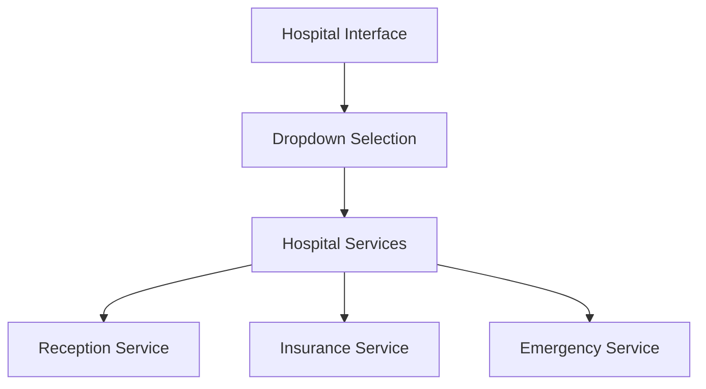

# Hospital Buddy System Frontend Modifications

## 1. System Overview

Converting the current Tata Play demo into a Hospital Management System by modifying the frontend components and dropdown options.



## 2. Frontend Changes

### 2.1 Dropdown Modifications
Replace current service options with:

```typescript
const hospitalServices = [
  {
    value: "reception",
    label: "Hospital Reception",
    description: "General inquiries, appointments, and patient registration"
  },
  {
    value: "insurance",
    label: "Insurance Processing",
    description: "Insurance verification and claims processing"
  },
  {
    value: "emergency",
    label: "Emergency Response",
    description: "Urgent care and emergency services"
  }
];
```

### 2.2 UI Updates

#### Layout Changes
- Update header with hospital logo and emergency contact
- Modify hero section with healthcare focus
- Update features section with hospital services

#### Color Scheme
- Primary: #0047AB (Hospital Blue)
- Secondary: #FFFFFF (White)
- Accent: #FF0000 (Emergency Red)

#### Content Updates
- Update page title to "Hospital Buddy System"
- Modify service descriptions for healthcare context
- Update call-to-action buttons with medical terminology

### 2.3 AI Prompts Update

#### Reception Service
```
You are a professional hospital receptionist AI assistant.
Key responsibilities:
- Schedule appointments
- Handle general inquiries
- Direct patients to departments
- Process patient information
```

#### Insurance Service
```
You are an insurance processing AI specialist.
Key responsibilities:
- Verify insurance coverage
- Process claims
- Explain benefits
- Handle billing inquiries
```

#### Emergency Service
```
You are an emergency response AI coordinator.
Key responsibilities:
- Assess emergencies
- Provide urgent care guidance
- Coordinate medical response
- Give first-aid instructions
```

## 3. Implementation Steps

1. Update CustomSelect component with hospital services
2. Modify layout components (Header, HeroSection)
3. Update AI prompts and call handling
4. Test user flow and interactions

## 4. Testing Focus

- Dropdown functionality
- Service selection flow
- Mobile responsiveness
- Call connection reliability

This simplified plan focuses on essential frontend modifications to transform the current demo into a hospital-oriented system.
